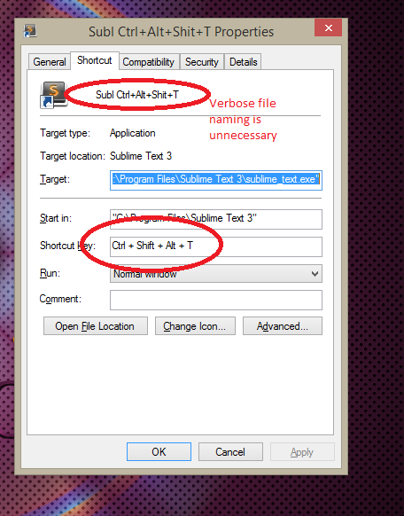

How to make a hotkey-ed ShrugDude
===

1. Install [Sublime Text 2 (or 3)](http://www.sublimetext.com/). 3 is in beta, but it's more compatible with packages and plugins that can enhance your stuff (like more aggressive auto-complete). Sublime is a great text editor, particularly because of it's `Ctrl + D` multi-select/multi-edit capabilities. You’ll have to set it as your default text editor (to do so, right click any `.txt` file > `Open with...` > `Always open with Sublime Text 2/3`).
2. Create a text file called `List.txt`. You should stick it somewhere inside your folder structure. Create a shortcut to it on your Desktop. You'll have to keep the shortcut there, or else your hotkeys won't apply (because Windows). Right-click the said shortcut > `Properties` (or to quickly get to `Properties`, highlight the shortcut and hit `Alt + Enter`). Set the shortcut to be something handy for you that you **don't often use**, such as `Ctrl + Alt + L`.

3. Inside that `List.txt`, put a shrug dude on the first line. If you don't already have shrug-dude copied on your clipboard, go to any site (like [this](http://www.theatlantic.com/technology/archive/2014/05/the-best-way-to-type-__/371351/) one) and get it.
4. Now everything is ready. To copy an entire line in Sublime, you can just hit `Ctrl + C`, **even if you didn't highlight the line**. 

## Recap
Suppose you want to quickly send a shrug-dude to someone. Hit these exact keys to copy a shrug-dude to your clipboard. 
1. `Ctrl + Alt + L`
2. `Ctrl + C`
(no mouse clicking necessary, and you're ready to paste him!)